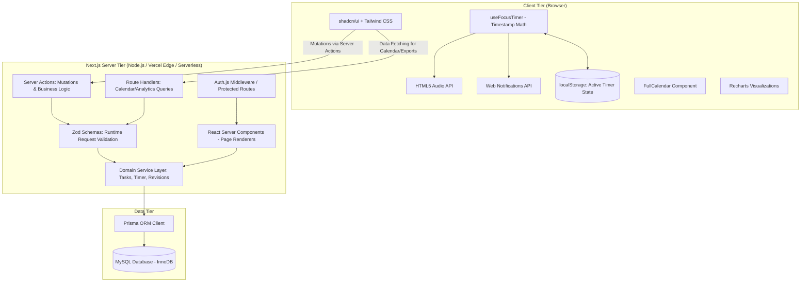

# LearnTrack — Technical Architecture Document

**Document Version:** 1.0.0  
**Status:** Approved for Implementation  
**Framework:** Next.js (App Router) + TypeScript + MySQL + Prisma + Auth.js

---

## 1. System Architecture Overview

LearnTrack is architected as a high-performance, modular full-stack application built on the **Next.js App Router**. It leverages React Server Components (RSC) for zero-bundle-size server rendering, Server Actions for transactional mutations, and minimal client components for interactive UI elements (such as the 45-minute focus timer, chart interactions, and form states).



---

## 2. Technology Stack & Architectural Decision Records (ADRs)

| Layer | Selected Technology | Architectural Justification |
| :--- | :--- | :--- |
| **Framework** | **Next.js (App Router)** | Provides unified server-side rendering, streaming, Server Actions, and colocation of data fetching with UI components. |
| **Language** | **TypeScript (Strict)** | Enforces end-to-end type safety between Prisma models, Zod schemas, Server Actions, and UI components. |
| **Database** | **MySQL (InnoDB Engine)** | Enterprise-grade ACID transactions required for multi-record revision scheduling and topic completion workflows. |
| **ORM** | **Prisma** | Generates type-safe database queries, manages declarative migrations, and provides transactional guarantees (`$transaction`). |
| **Authentication** | **Auth.js (NextAuth v5)** | Industry-standard authentication handling secure HTTP-only cookies, session rotation, and multi-provider extensibility. |
| **Validation** | **Zod** | Single source of truth for runtime validation on both client forms (React Hook Form resolver) and server entry points. |
| **Styling** | **Tailwind CSS** | Utility-first CSS providing predictable styling, zero runtime overhead, and custom color token integration. |
| **UI Components** | **shadcn/ui** | Copy-and-own Radix UI primitives ensuring complete accessibility (WCAG AA) and customization without vendor lock-in. |
| **Charts** | **Recharts** | Declarative SVG charting library providing responsive, high-performance data visualizations. |
| **Calendar** | **FullCalendar** | Robust scheduling engine capable of displaying month, week, and day views for dense task and revision events. |
| **Testing** | **Vitest + Playwright** | Vitest for instant unit and integration testing; Playwright for cross-browser end-to-end user journey verification. |

---

## 3. Server Actions vs. API Routes Strategy

### 3.1 When to Use Server Actions
Server Actions are the **default mutation pattern** for all user-initiated state changes:
* Creating, updating, and deleting `LearningTask` entities.
* Starting, pausing, resuming, and completing `FocusSession` entities.
* Submitting `LearningLog` reflections.
* Generating the 4-stage `Revision` schedule and marking revisions complete.
* Modifying user profile and notification settings.

**Why:** Server Actions integrate seamlessly with Next.js revalidation (`revalidatePath`, `revalidateTag`), eliminate boilerplate REST endpoint management, and automatically inherit server session context.

### 3.2 When to Use API Route Handlers (`app/api/...`)
API Route Handlers are reserved for specific non-action use cases:
* **Complex Range Queries & Calendar Feeds:** Endpoint `/api/calendar/events` returning JSON for FullCalendar dynamic windowing.
* **Bulk Data Export:** Endpoint `/api/user/export` streaming a JSON/CSV archive of the user's entire history.
* **External Webhooks / Health Checks:** `/api/health` for uptime monitoring.

---

## 4. Multi-Tenant User Isolation & Data Security

### 4.1 Strict Session Derivation
To prevent Broken Object-Level Authorization (BOLA/IDOR):
1. **Never Trust Client-Sent `userId`:** Server Actions and API routes do **not** accept `userId` in input payloads.
2. **Authoritative Session Extraction:** The authenticated user's ID is extracted directly from the verified session via `auth()`:
   ```typescript
   const session = await auth();
   if (!session?.user?.id) {
     throw new UnauthorizedError("Authentication required.");
   }
   const userId = session.user.id;
   ```
3. **Scoped Prisma Queries:** All Prisma queries must include `where: { userId }` or verify parent task ownership:
   ```typescript
   const task = await prisma.learningTask.findFirst({
     where: { id: taskId, userId: session.user.id },
   });
   if (!task) throw new NotFoundError("Task not found or access denied.");
   ```

---

## 5. State Management & Hydration Architecture

### 5.1 Server-Rendered State vs. Client State
* **Server State:** Handled natively by React Server Components fetching data from Prisma services. Revalidated on mutation via `revalidatePath('/dashboard')`.
* **Ephemeral Client State:** Form input state (React Hook Form), modal visibility, and active timer ticking.
* **Active Timer State Synchronization:**
  * To survive tab switches, page reloads, and browser crashes, the active focus session state is saved to both the database and `localStorage`.
  * Structure in `localStorage`:
    ```json
    {
      "sessionId": "clx...",
      "taskId": "clx...",
      "taskTitle": "Distributed Systems",
      "plannedDuration": 2700,
      "startTime": 1757424000000,
      "accumulatedPausedSeconds": 0,
      "status": "ACTIVE",
      "lastSyncedAt": 1757424005000
    }
    ```
  * On mount, `useFocusTimer` reads this structure, computes the exact elapsed seconds against `Date.now()`, and synchronizes with the server.

---

## 6. Timezone Handling Architecture

### 6.1 The "Off-By-One-Day" Problem & Solution
Spaced repetition depends on calendar days, not raw UTC timestamps. If a revision is due on "September 13", it must remain September 13 regardless of whether the user checks it at 8:00 AM or 11:30 PM in their local timezone.

### 6.2 Architectural Rules for Dates
1. **Calendar Dates as Normalized Strings (`YYYY-MM-DD`):**
   * Fields representing pure calendar dates (`plannedDate`, `scheduledDate`) are stored either as ISO date strings (`2026-09-10`) or as MySQL `DATE` columns (e.g. `2026-09-10`).
2. **Timestamps as UTC Date-Times:**
   * Fields representing instantaneous physical events (`startedAt`, `completedAt`, `createdAt`) are stored as MySQL `DATETIME(3)` in UTC.
3. **User Timezone Storage:**
   * The user's IANA Timezone string (e.g., `"America/New_York"`, `"Asia/Kolkata"`) is stored in the `User` entity.
   * Calculations for "Today" and streak boundaries are evaluated in the user's local timezone using `date-fns-tz` or native `Intl`.

---

## 7. Recommended Project Directory Structure

```
learn-track/
├── .github/                     # CI/CD workflows, issue templates
├── docs/                        # Complete technical and product documentation
│   ├── 01-product-requirements.md
│   ├── ...
│   └── 15-development-roadmap.md
├── prisma/
│   ├── schema.prisma            # Normalized database schema
│   ├── migrations/              # Prisma migration history
│   └── seed.ts                  # Development seed data
├── public/
│   ├── sounds/                  # Audio chime assets (.mp3, .ogg)
│   ├── icons/                   # PWA & Web Notification icons
│   └── favicon.ico
├── src/
│   ├── app/                     # Next.js App Router routes
│   │   ├── (auth)/              # Route group for authentication
│   │   │   ├── login/
│   │   │   └── register/
│   │   ├── (dashboard)/         # Protected application layout group
│   │   │   ├── dashboard/       # Executive overview
│   │   │   ├── planner/         # Daily learning agenda
│   │   │   ├── focus/           # 45-minute focus timer mode
│   │   │   ├── tasks/[id]/      # Detailed topic inspection & logs
│   │   │   ├── revisions/       # Spaced revision center
│   │   │   ├── calendar/        # FullCalendar visualizer
│   │   │   ├── analytics/       # Recharts metric dashboards
│   │   │   └── settings/        # Profile and notification preferences
│   │   ├── api/                 # API route handlers (Calendar feed, exports)
│   │   ├── layout.tsx           # Global HTML root layout
│   │   └── page.tsx             # Marketing/Landing redirect
│   ├── components/              # Shared UI components
│   │   ├── ui/                  # shadcn/ui primitive components
│   │   ├── common/              # Navbar, Sidebar, UserDropdown, Breadcrumbs
│   │   └── feedback/            # NotificationBanners, ModalDialogs
│   ├── features/                # Domain-driven feature modules
│   │   ├── tasks/               # TaskCard, TaskForm, TaskActions
│   │   ├── focus/               # FocusClock, TimerControls, useFocusTimer
│   │   ├── logs/                # LearningLogModal, ConfidenceSelector
│   │   ├── revisions/           # RevisionCard, ActiveRecallDrawer
│   │   ├── calendar/            # FullCalendarWrapper, EventSheet
│   │   └── analytics/           # FocusChart, RetentionChart, StreakCard
│   ├── hooks/                   # Custom reusable React hooks
│   │   ├── use-audio-chime.ts   # HTML5 audio playback helper
│   │   ├── use-notifications.ts # Web Notifications API manager
│   │   └── use-local-storage.ts # LocalStorage state synchronizer
│   ├── lib/                     # Core utility libraries
│   │   ├── auth.ts              # Auth.js configuration & handlers
│   │   ├── db.ts                # PrismaClient singleton instance
│   │   ├── date-utils.ts        # Timezone & date calculation helpers
│   │   └── utils.ts             # Tailwind cn() and general helpers
│   ├── server/                  # Server-side business logic
│   │   ├── actions/             # Next.js Server Actions (mutations)
│   │   ├── services/            # Domain service classes (Tasks, Timer, Revisions)
│   │   └── validators/          # Zod validation schemas
│   └── types/                   # Shared TypeScript interfaces and enums
├── tests/                       # Automated test suite
│   ├── unit/                    # Vitest unit tests (Calculators, Validators)
│   ├── integration/             # Vitest integration tests (Server Actions, DB)
│   └── e2e/                     # Playwright end-to-end tests
├── AGENTS.md                    # Agent coding and architectural constraints
├── README.md                    # Project overview & local setup guide
├── tailwind.config.ts           # Tailwind configuration & theme tokens
├── tsconfig.json                # Strict TypeScript configuration
└── package.json                 # Locked dependency manifest
```
