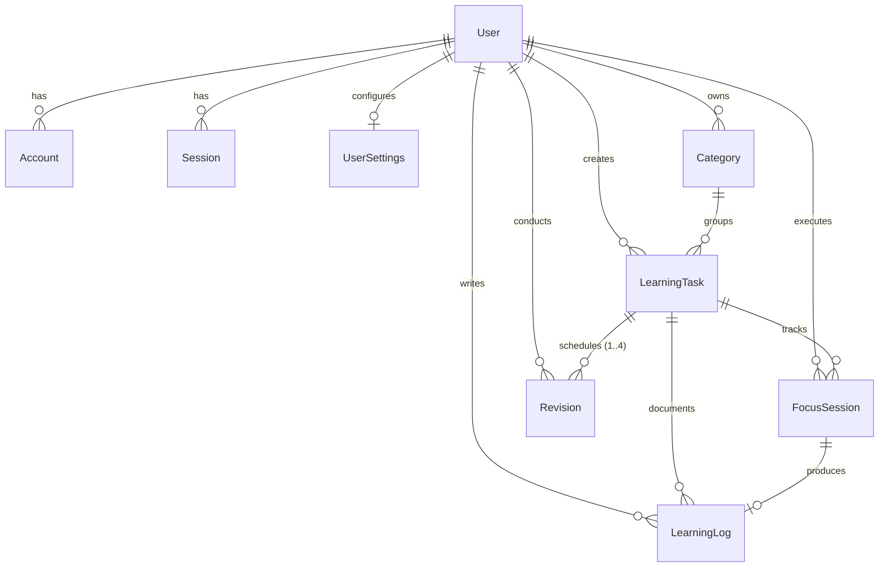

# LearnTrack — Database Schema & Data Modeling Specification

**Document Version:** 1.0.0  
**Status:** Approved for Implementation  
**RDBMS:** MySQL 8.0+ (InnoDB Storage Engine)  
**ORM:** Prisma 5.x / 6.x

---

## 1. Relational Entity Relationship Diagram (ERD)



---

## 2. Entity Dictionary & Detailed Field Specifications

### 2.1 Entity: `User`
Stores authenticated identity, profile credentials, and timezone preferences.
* `id` (`VARCHAR(36)` / `cuid()`): Primary Key.
* `name` (`VARCHAR(191)`): Optional display name.
* `email` (`VARCHAR(191)`): Unique, required user email.
* `emailVerified` (`DATETIME(3)`): Optional email verification timestamp.
* `passwordHash` (`VARCHAR(255)`): Hashed credentials (argon2id or bcrypt).
* `timezone` (`VARCHAR(50)`): Default `"UTC"`. E.g., `"America/New_York"`, `"Asia/Kolkata"`.
* `createdAt` (`DATETIME(3)`): Auto-timestamp on creation.
* `updatedAt` (`DATETIME(3)`): Auto-timestamp on update.

### 2.2 Entity: `UserSettings`
Stores user preferences for timer, audio, and desktop notifications.
* `id` (`VARCHAR(36)` / `cuid()`): Primary Key.
* `userId` (`VARCHAR(36)`): Foreign Key -> `User.id` (Unique, 1-to-1).
* `defaultFocusDuration` (`INT`): Default focus duration in seconds (Default: `2700` = 45 min).
* `soundEnabled` (`BOOLEAN`): Default `true`.
* `soundVolume` (`FLOAT`): Default `0.8` (0.0 to 1.0).
* `soundChoice` (`VARCHAR(50)`): Default `"bell"`. Options: `"bell"`, `"bowl"`, `"gong"`.
* `notificationsEnabled` (`BOOLEAN`): Default `true`.

### 2.3 Entity: `Category`
User-defined categorization for learning topics (e.g., "Algorithms", "System Design").
* `id` (`VARCHAR(36)` / `cuid()`): Primary Key.
* `userId` (`VARCHAR(36)`): Foreign Key -> `User.id`.
* `name` (`VARCHAR(100)`): Name of category.
* `color` (`VARCHAR(20)`): Hex or CSS color token (e.g., `"#3B82F6"`).
* `createdAt` / `updatedAt`: Timestamps.
* *Constraints:* `@@unique([userId, name])` (Unique category name per user).

### 2.4 Entity: `LearningTask`
Core domain unit representing a specific learning topic or subject module.
* `id` (`VARCHAR(36)` / `cuid()`): Primary Key.
* `userId` (`VARCHAR(36)`): Foreign Key -> `User.id` (Indexed).
* `categoryId` (`VARCHAR(36)`): Foreign Key -> `Category.id` (Nullable, on delete Set Null).
* `title` (`VARCHAR(191)`): Title of study topic (3–120 characters).
* `description` (`TEXT`): Optional markdown study notes/resources.
* `plannedDate` (`DATE`): Local calendar date string or date object (`YYYY-MM-DD`).
* `priority` (`ENUM('LOW', 'MEDIUM', 'HIGH')`): Default `'MEDIUM'`.
* `estimatedSessions` (`INT`): Target 45m sessions (Default: `2`).
* `completedSessions` (`INT`): Derived completed session counter (Default: `0`).
* `totalFocusMinutes` (`INT`): Total cumulative focus minutes (Default: `0`).
* `status` (`ENUM('PLANNED', 'IN_PROGRESS', 'LEARNING_COMPLETED', 'REVISION_PENDING', 'FULLY_COMPLETED')`): Default `'PLANNED'`.
* `learningCompletedAt` (`DATETIME(3)`): Timestamp when user marked topic learned.
* `fullyCompletedAt` (`DATETIME(3)`): Timestamp when Revision 4 completed.
* `createdAt` / `updatedAt`: Timestamps.

### 2.5 Entity: `FocusSession`
Individual deliberate focus blocks (default: 45 minutes).
* `id` (`VARCHAR(36)` / `cuid()`): Primary Key.
* `userId` (`VARCHAR(36)`): Foreign Key -> `User.id` (Indexed).
* `learningTaskId` (`VARCHAR(36)`): Foreign Key -> `LearningTask.id` (Indexed, on delete Cascade).
* `startedAt` (`DATETIME(3)`): Physical session initiation time.
* `endedAt` (`DATETIME(3)`): Physical session completion/termination time.
* `plannedDuration` (`INT`): Duration in seconds (Default: `2700`).
* `actualDuration` (`INT`): Actual active study duration in seconds (excluding pause time).
* `pausedDuration` (`INT`): Total accumulated pause time in seconds (Default: `0`).
* `status` (`ENUM('ACTIVE', 'PAUSED', 'COMPLETED', 'CANCELLED', 'INTERRUPTED')`): Default `'ACTIVE'`.
* `createdAt` / `updatedAt`: Timestamps.

### 2.6 Entity: `LearningLog`
Reflective synthesis logged immediately following a focus session.
* `id` (`VARCHAR(36)` / `cuid()`): Primary Key.
* `userId` (`VARCHAR(36)`): Foreign Key -> `User.id` (Indexed).
* `learningTaskId` (`VARCHAR(36)`): Foreign Key -> `LearningTask.id` (Indexed, on delete Cascade).
* `focusSessionId` (`VARCHAR(36)`): Foreign Key -> `FocusSession.id` (Unique, 1-to-1, on delete Cascade).
* `whatLearned` (`TEXT`): Required reflection text.
* `whatCompleted` (`VARCHAR(255)`): Practical outputs or exercises finished.
* `doubts` (`TEXT`): Questions or uncertainties for future review.
* `notes` (`TEXT`): Supplementary references and code snippets.
* `confidence` (`TINYINT`): Confidence score from 1 (Very Low) to 5 (Very High).
* `createdAt` / `updatedAt`: Timestamps.

### 2.7 Entity: `Revision`
Automated spaced repetition milestones generated for each learned topic.
* `id` (`VARCHAR(36)` / `cuid()`): Primary Key.
* `userId` (`VARCHAR(36)`): Foreign Key -> `User.id` (Indexed).
* `learningTaskId` (`VARCHAR(36)`): Foreign Key -> `LearningTask.id` (Indexed, on delete Cascade).
* `revisionNumber` (`TINYINT`): Index of milestone: `1` (Day 0), `2` (Day +3), `3` (Day +15), `4` (Day +30).
* `scheduledDate` (`DATE`): Calculated revision date (`YYYY-MM-DD`).
* `status` (`ENUM('PENDING', 'DUE', 'IN_PROGRESS', 'COMPLETED', 'OVERDUE', 'SKIPPED')`): Default `'PENDING'`.
* `startedAt` (`DATETIME(3)`): Optional review start timestamp.
* `completedAt` (`DATETIME(3)`): Timestamp when marked completed.
* `notes` (`TEXT`): Review reflections, answers to prior doubts.
* `confidence` (`TINYINT`): Post-revision confidence score (1–5).
* `createdAt` / `updatedAt`: Timestamps.
* *Constraints:* `@@unique([learningTaskId, revisionNumber])` (Prevents duplicate milestone records).

---

## 3. Database Indexes & Performance Optimization

To guarantee sub-50ms query response times under high data volume, the following composite indexes are specified:

| Table | Index Name | Columns | Purpose |
| :--- | :--- | :--- | :--- |
| `LearningTask` | `idx_tasks_user_date` | `(userId, plannedDate)` | Rapid retrieval of Daily Planner agenda. |
| `LearningTask` | `idx_tasks_user_status` | `(userId, status)` | Fast filtering for Dashboard and active tasks. |
| `FocusSession` | `idx_sessions_user_status` | `(userId, status)` | Instant lookup of currently `ACTIVE` or `PAUSED` timer. |
| `FocusSession` | `idx_sessions_user_dates` | `(userId, startedAt)` | Fast aggregation for daily/weekly/monthly analytics. |
| `Revision` | `idx_revisions_user_sched` | `(userId, scheduledDate, status)` | High-speed retrieval of Due and Overdue revisions. |
| `Revision` | `idx_revisions_task_number` | `(learningTaskId, revisionNumber)` | Instant verification of topic mastery. |
| `LearningLog` | `idx_logs_user_task` | `(userId, learningTaskId)` | Fetching complete log history for task detail view. |

---

## 4. Complete Prisma Schema Definition (`prisma/schema.prisma`)

```prisma
datasource db {
  provider = "mysql"
  url      = env("DATABASE_URL")
}

generator client {
  provider = "prisma-client-js"
}

enum Priority {
  LOW
  MEDIUM
  HIGH
}

enum TaskStatus {
  PLANNED
  IN_PROGRESS
  LEARNING_COMPLETED
  REVISION_PENDING
  FULLY_COMPLETED
}

enum SessionStatus {
  ACTIVE
  PAUSED
  COMPLETED
  CANCELLED
  INTERRUPTED
}

enum RevisionStatus {
  PENDING
  DUE
  IN_PROGRESS
  COMPLETED
  OVERDUE
  SKIPPED
}

model User {
  id            String         @id @default(cuid())
  name          String?
  email         String         @unique
  emailVerified DateTime?
  image         String?
  passwordHash  String?
  timezone      String         @default("UTC")
  createdAt     DateTime       @default(now())
  updatedAt     DateTime       @updatedAt

  accounts      Account[]
  sessions      Session[]
  settings      UserSettings?
  categories    Category[]
  tasks         LearningTask[]
  focusSessions FocusSession[]
  learningLogs  LearningLog[]
  revisions     Revision[]

  @@map("users")
}

model Account {
  id                String  @id @default(cuid())
  userId            String
  type              String
  provider          String
  providerAccountId String
  refresh_token     String? @db.Text
  access_token      String? @db.Text
  expires_at        Int?
  token_type        String?
  scope             String?
  id_token          String? @db.Text
  session_state     String?

  user User @relation(fields: [userId], references: [id], onDelete: Cascade)

  @@unique([provider, providerAccountId])
  @@map("accounts")
}

model Session {
  id           String   @id @default(cuid())
  sessionToken String   @unique
  userId       String
  expires      DateTime
  user         User     @relation(fields: [userId], references: [id], onDelete: Cascade)

  @@map("sessions")
}

model UserSettings {
  id                   String  @id @default(cuid())
  userId               String  @unique
  defaultFocusDuration Int     @default(2700)
  soundEnabled         Boolean @default(true)
  soundVolume          Float   @default(0.8)
  soundChoice          String  @default("bell")
  notificationsEnabled Boolean @default(true)
  user                 User    @relation(fields: [userId], references: [id], onDelete: Cascade)

  @@map("user_settings")
}

model Category {
  id        String   @id @default(cuid())
  userId    String
  name      String
  color     String   @default("#2563EB")
  createdAt DateTime @default(now())
  updatedAt DateTime @updatedAt

  user  User           @relation(fields: [userId], references: [id], onDelete: Cascade)
  tasks LearningTask[]

  @@unique([userId, name])
  @@map("categories")
}

model LearningTask {
  id                  String     @id @default(cuid())
  userId              String
  categoryId          String?
  title               String     @db.VarChar(191)
  description         String?    @db.Text
  plannedDate         DateTime   @db.Date
  priority            Priority   @default(MEDIUM)
  estimatedSessions   Int        @default(2)
  completedSessions   Int        @default(0)
  totalFocusMinutes   Int        @default(0)
  status              TaskStatus @default(PLANNED)
  learningCompletedAt DateTime?
  fullyCompletedAt    DateTime?
  createdAt           DateTime   @default(now())
  updatedAt           DateTime   @updatedAt

  user          User           @relation(fields: [userId], references: [id], onDelete: Cascade)
  category      Category?      @relation(fields: [categoryId], references: [id], onDelete: SetNull)
  focusSessions FocusSession[]
  learningLogs  LearningLog[]
  revisions     Revision[]

  @@index([userId, plannedDate], name: "idx_tasks_user_date")
  @@index([userId, status], name: "idx_tasks_user_status")
  @@map("learning_tasks")
}

model FocusSession {
  id              String        @id @default(cuid())
  userId          String
  learningTaskId  String
  startedAt       DateTime      @default(now())
  endedAt         DateTime?
  plannedDuration Int           @default(2700)
  actualDuration  Int           @default(0)
  pausedDuration  Int           @default(0)
  status          SessionStatus @default(ACTIVE)
  createdAt       DateTime      @default(now())
  updatedAt       DateTime      @updatedAt

  user        User          @relation(fields: [userId], references: [id], onDelete: Cascade)
  task        LearningTask  @relation(fields: [learningTaskId], references: [id], onDelete: Cascade)
  learningLog LearningLog?

  @@index([userId, status], name: "idx_sessions_user_status")
  @@index([userId, startedAt], name: "idx_sessions_user_dates")
  @@index([learningTaskId], name: "idx_sessions_task")
  @@map("focus_sessions")
}

model LearningLog {
  id             String   @id @default(cuid())
  userId         String
  learningTaskId String
  focusSessionId String   @unique
  whatLearned    String   @db.Text
  whatCompleted  String?  @db.VarChar(255)
  doubts         String?  @db.Text
  notes          String?  @db.Text
  confidence     Int      @db.TinyInt
  createdAt      DateTime @default(now())
  updatedAt      DateTime @updatedAt

  user         User         @relation(fields: [userId], references: [id], onDelete: Cascade)
  task         LearningTask @relation(fields: [learningTaskId], references: [id], onDelete: Cascade)
  focusSession FocusSession @relation(fields: [focusSessionId], references: [id], onDelete: Cascade)

  @@index([userId, learningTaskId], name: "idx_logs_user_task")
  @@map("learning_logs")
}

model Revision {
  id             String         @id @default(cuid())
  userId         String
  learningTaskId String
  revisionNumber Int            @db.TinyInt
  scheduledDate  DateTime       @db.Date
  status         RevisionStatus @default(PENDING)
  startedAt      DateTime?
  completedAt    DateTime?
  notes          String?        @db.Text
  confidence     Int?           @db.TinyInt
  createdAt      DateTime       @default(now())
  updatedAt      DateTime       @updatedAt

  user User         @relation(fields: [userId], references: [id], onDelete: Cascade)
  task LearningTask @relation(fields: [learningTaskId], references: [id], onDelete: Cascade)

  @@unique([learningTaskId, revisionNumber], name: "unique_task_revision_number")
  @@index([userId, scheduledDate, status], name: "idx_revisions_user_sched")
  @@map("revisions")
}
```
