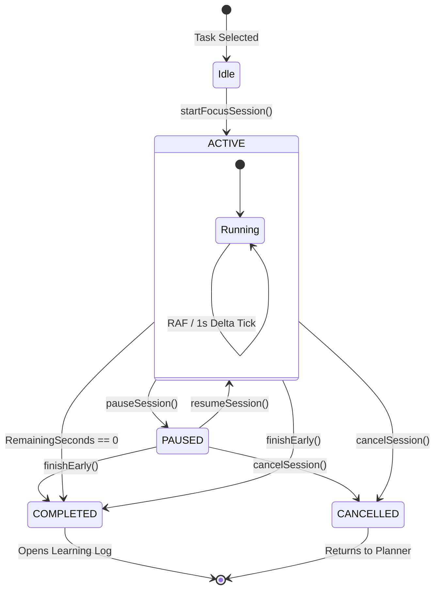

# LearnTrack — 45-Minute Focus Session & Timer Specification

**Document Version:** 1.0.0  
**Status:** Approved for Implementation  
**Standard Duration:** 2,700 Seconds (45 Minutes)  
**Timing Model:** Timestamp Delta Mathematics (Zero-Drift Architecture)

---

## 1. Timing Model & Mathematical Foundation

### 1.1 The Inadequacy of `setInterval()`
Traditional web timers rely on simple iteration counters:
```javascript
// ANTIPATTERN: Suffers from severe drift
setInterval(() => {
  setSecondsRemaining(prev => prev - 1);
}, 1000);
```
**Why this fails in production:**
1. **Event Loop Jitter:** JavaScript's single-threaded event loop delays timer callbacks when heavy DOM rendering, garbage collection, or network handlers execute.
2. **Browser Tab Throttling:** Modern browsers (Chrome, Safari, Edge, Firefox) aggressively throttle background tabs, executing timers as infrequently as once every 60 seconds or suspending them entirely.
3. **OS Sleep & Hibernation:** If a laptop lid is closed or the OS enters sleep mode, `setInterval` stops ticking completely.

### 1.2 The LearnTrack Timestamp Delta Algorithm
To eliminate all drift and remain 100% resilient across background throttling, window minimizes, and system sleep, LearnTrack uses **Epoch Timestamp Math**:

$$\text{ActiveElapsedSeconds} = \left\lfloor \frac{\text{CurrentTimestamp} - \text{SessionStartTimestamp} - \text{TotalAccumulatedPausedDuration}}{1000} \right\rfloor$$

$$\text{RemainingSeconds} = \max(0, \text{PlannedDurationSeconds} - \text{ActiveElapsedSeconds})$$

* `SessionStartTimestamp`: Epoch milliseconds captured when the user started or unpaused.
* `TotalAccumulatedPausedDuration`: Milliseconds spent in the `PAUSED` state.
* `PlannedDurationSeconds`: Exactly `2700` (45 minutes).
* `CurrentTimestamp`: Fresh `Date.now()` invoked on every render tick or requestAnimationFrame.

---

## 2. Timer State Machine



---

## 3. Resilience & Edge Case Handlers

### 3.1 Scenario A: Browser Tab Switching & Background Execution
* **Behavior:** Browser throttles the execution rate of the timer component.
* **Resolution:** A native `visibilitychange` event listener catches when the tab returns to the foreground (`document.visibilityState === 'visible'`). The hook immediately re-evaluates `Date.now() - startTime`, recalculating the exact remaining seconds without losing a single millisecond.

### 3.2 Scenario B: Page Refresh or Accidental Navigation
* **Behavior:** The user accidentally presses `F5` or navigates away.
* **Resolution:** Active session state is written to `localStorage` under key `learntrack_active_timer`. Upon component mount, the custom hook `useFocusTimer` inspects `localStorage`. If an active session exists, it restores the session without resetting the clock:
  ```typescript
  interface StoredTimerState {
    sessionId: string;
    taskId: string;
    taskTitle: string;
    startTime: number;       // Epoch ms
    plannedDuration: number; // 2700
    pausedDuration: number;  // ms
    isPaused: boolean;
    pauseStartTime: number | null;
  }
  ```

### 3.3 Scenario C: System Sleep / Laptop Lid Closed
* **Behavior:** The user works for 20 minutes, closes their laptop for 30 minutes, and reopens it.
* **Resolution:** The delta calculation reveals:
  $$\text{Elapsed} = 20\text{ min} + 30\text{ min} = 50\text{ min} > 45\text{ min}$$
  The timer immediately detects $\text{RemainingSeconds} = 0$, marks the session as `COMPLETED`, fires completion signals, and presents the Learning Log.

### 3.4 Scenario D: Abandoned Session Cleanup
* **Behavior:** The user starts a session and abandons the browser tab for $> 4$ hours.
* **Resolution:** If an active session is rehydrated where $\text{Elapsed} > \text{PlannedDuration} + 14400$ (4 hours), the system prompts the user: *"We noticed this focus session was left open. Would you like to log the completed 45 minutes, or discard this session?"*

### 3.5 Scenario E: Preventing Multiple Concurrent Sessions
* **Rule:** A user can only run **one** focus session at a time across all browser windows.
* **Enforcement:**
  1. Client: `BroadcastChannel('learntrack_timer')` syncs state between multiple open tabs. Starting a session in Tab 2 alerts Tab 1.
  2. Server: `startFocusSession` checks MySQL for existing `FocusSession` with `status: 'ACTIVE'`. If found, rejects with a 409 Conflict.

---

## 4. UI / Visual Presentation

### 4.1 Document Title Synchronization
While the timer runs, the browser tab title is updated dynamically:
* `ACTIVE` state: `"34:12 — TypeScript Generics | LearnTrack"`
* `PAUSED` state: `"[PAUSED] 34:12 — TypeScript Generics"`
* `COMPLETED` state: `"🔔 Focus Complete! Log Your Learnings"`

### 4.2 Tabular Typography & Circular SVG Ring
* **Typography:** Rendered using `font-mono tabular-nums` to guarantee characters occupy equal horizontal widths, eliminating layout shudder during countdowns.
* **Progress Ring Math:**
  ```typescript
  const radius = 140;
  const circumference = 2 * Math.PI * radius;
  const progressOffset = circumference - (elapsedSeconds / 2700) * circumference;
  ```
  The SVG stroke animates with CSS `transition: stroke-dashoffset 0.5s ease-out`.

---

## 5. Transition to Reflective Learning Log

When `RemainingSeconds` reaches 0:
1. `completeFocusSession` Server Action is automatically invoked.
2. Web Notification is dispatched.
3. Audio chime plays.
4. Screen transitions from the timer canvas to the **Learning Session Log Modal** with focus locked to the "What did I learn?" textarea.
