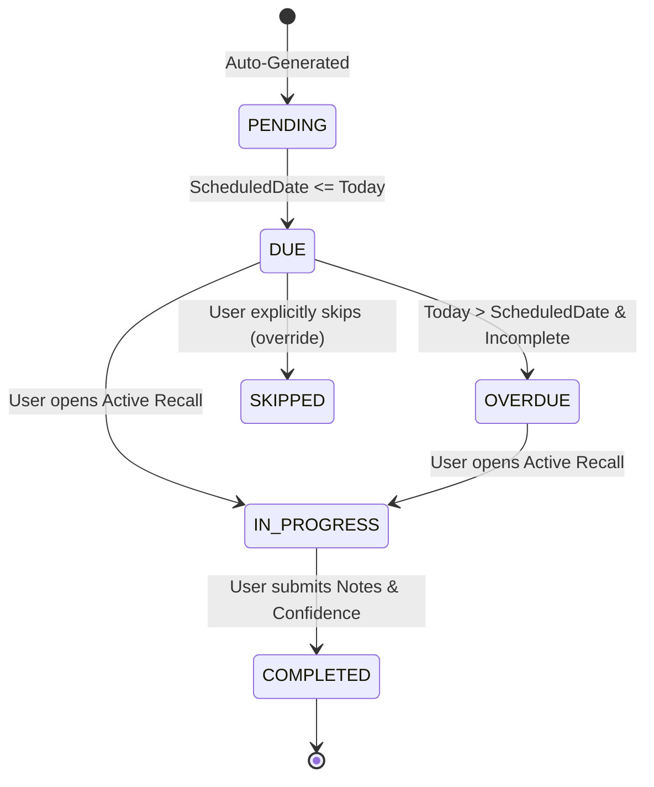

# LearnTrack — Spaced Revision Engine & Mastery Logic

**Document Version:** 1.0.0  
**Status:** Approved for Implementation  
**Core Model:** 4-Stage Fixed Spaced Repetition (Day 0, Day +3, Day +15, Day +30)  
**Invariant:** Topics become `FULLY_COMPLETED` strictly upon completion of all 4 revisions.

---

## 1. Pedagogical Foundation & Interval Rationale

LearnTrack enforces a fixed 4-interval spaced repetition algorithm designed to counteract Ebbinghaus forgetting-curve decay:

| Milestone | Offset from Completion | Target Cognitive Mechanism |
| :--- | :--- | :--- |
| **Revision 1** | **Day 0 (Same Day)** | **Immediate Consolidation:** Review before the first sleep cycle; resolves immediate doubts. |
| **Revision 2** | **Day +3** | **Decay Interception:** Re-evaluates mental models at the inflection point of steep memory decay. |
| **Revision 3** | **Day +15** | **Intermediate Retrieval:** Tests active recall without reference material; converts to long-term storage. |
| **Revision 4** | **Day +30** | **Mastery Verification:** Confirms permanent semantic encoding and effortless retrieval. |

> [!IMPORTANT]
> These four intervals (Day 0, +3, +15, +30) are core product requirements. They must not be modified or replaced with dynamic algorithmic intervals in the MVP.

---

## 2. Mathematical Date Calculation Engine

### 2.1 Deterministic Date Math
Given completion calendar date $D$ formatted as `YYYY-MM-DD` in the learner's local timezone:

$$\text{ScheduledDate}(\text{Rev 1}) = D + 0 \text{ days} = D$$
$$\text{ScheduledDate}(\text{Rev 2}) = D + 3 \text{ days}$$
$$\text{ScheduledDate}(\text{Rev 3}) = D + 15 \text{ days}$$
$$\text{ScheduledDate}(\text{Rev 4}) = D + 30 \text{ days}$$

### 2.2 Concrete Date Example
| Milestone | Calculation | Resulting Scheduled Date |
| :--- | :--- | :--- |
| **Learning Completed** | Initial Study Finished | **September 10, 2026** |
| **Revision 1** | Sept 10 + 0 days | **September 10, 2026** |
| **Revision 2** | Sept 10 + 3 days | **September 13, 2026** |
| **Revision 3** | Sept 10 + 15 days | **September 25, 2026** |
| **Revision 4** | Sept 10 + 30 days | **October 10, 2026** |

---

## 3. Revision State Machine & Status Definitions



* **`PENDING`:** The revision is scheduled for a future calendar date (`scheduledDate > today`).
* **`DUE`:** Today's local date matches the revision's `scheduledDate`. Surfaced on Dashboard.
* **`OVERDUE`:** Current local date is past `scheduledDate`, and status is not `COMPLETED` or `SKIPPED`. Remains prominently flagged in red until completed.
* **`IN_PROGRESS`:** The learner has opened the active recall drawer or launched an associated revision focus session.
* **`COMPLETED`:** The learner has conducted the review, submitted reflective notes, and logged a confidence score (1–5).
* **`SKIPPED`:** Administrative edge-case override (e.g., topic dropped).

---

## 4. Idempotency & Duplicate Prevention Architecture

### 4.1 Database Invariant
The database enforces a composite unique constraint in Prisma:
```prisma
@@unique([learningTaskId, revisionNumber], name: "unique_task_revision_number")
```
This physical database index makes it impossible for multiple records for "Revision 2" to ever be inserted for the same task.

### 4.2 Idempotent Generation Algorithm (Server Action)
```typescript
export async function generateRevisionsForTask(taskId: string, userId: string, tx: PrismaTransaction) {
  // 1. Check existing revisions
  const existing = await tx.revision.findMany({
    where: { learningTaskId: taskId },
    select: { revisionNumber: true },
  });

  if (existing.length === 4) {
    // Idempotent early return: schedule already exists
    return;
  }

  // 2. Fetch task completion date
  const task = await tx.learningTask.findUniqueOrThrow({
    where: { id: taskId, userId },
  });

  const baseDate = task.learningCompletedAt ?? new Date();
  
  // 3. Compute the 4 dates in user timezone
  const intervals = [0, 3, 15, 30];
  const revisionsData = intervals.map((days, index) => {
    const scheduledDate = addDaysToCalendarDate(baseDate, days, task.userTimezone);
    return {
      userId,
      learningTaskId: taskId,
      revisionNumber: index + 1,
      scheduledDate,
      status: index === 0 ? RevisionStatus.DUE : RevisionStatus.PENDING,
    };
  });

  // 4. Atomic batch insertion
  await tx.revision.createMany({
    data: revisionsData,
    skipDuplicates: true, // Safety fallback
  });
}
```

---

## 5. Active Recall Review Experience

When reviewing a due revision:
1. **Recall Phase (Hidden Notes):**
   * The UI displays the topic title and recorded doubts: *"Before looking at your notes, write down what you remember about this topic."*
2. **Comparison Phase (Reveal Notes):**
   * The learner expands an accordion displaying all historical `LearningLog` entries, past doubts, and prior confidence ratings.
3. **Reflection & Confidence Rating:**
   * The learner writes brief notes summarizing their retrieval fidelity.
   * Rates their current confidence on the 1–5 scale.
4. **Submission:**
   * Marks revision `COMPLETED` and recalculates topic completion status.

---

## 6. The Full Completion Rule (`FULLY_COMPLETED`)

### 6.1 Formal Rule Definition
A learning task is promoted to `FULLY_COMPLETED` **if and only if**:
1. Initial learning is completed (`task.learningCompletedAt !== null`).
2. Exactly 4 revision records exist for the task.
3. Every single revision has `status === 'COMPLETED'`.

$$\text{Task Status} = \text{FULLY\_COMPLETED} \iff \sum_{i=1}^{4} \mathbb{I}(\text{Rev}_i.\text{status} = \text{COMPLETED}) = 4$$

### 6.2 Transactional Enforcement
```typescript
export async function verifyAndPromoteTopicMastery(taskId: string, tx: PrismaTransaction): Promise<boolean> {
  const revisions = await tx.revision.findMany({
    where: { learningTaskId: taskId },
    select: { status: true },
  });

  const isMastered = revisions.length === 4 && revisions.every(r => r.status === RevisionStatus.COMPLETED);

  if (isMastered) {
    await tx.learningTask.update({
      where: { id: taskId },
      data: {
        status: TaskStatus.FULLY_COMPLETED,
        fullyCompletedAt: new Date(),
      },
    });
  }

  return isMastered;
}
```
* **Security Notice:** This check is executed exclusively within server-side transactions. Client UI state cannot bypass this rule.
