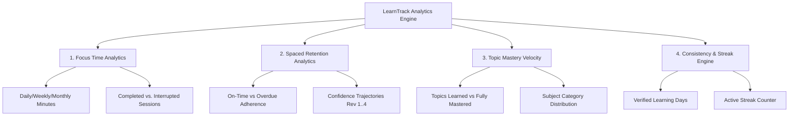

# LearnTrack — Learning Analytics & Streak Engine Specification

**Document Version:** 1.0.0  
**Status:** Approved for Implementation  
**Visualization Engine:** Recharts (SVG Responsive Charts)  
**Philosophy:** Deliberate Practice & Retention Metrics over Vanity Gamification

---

## 1. Analytics Domain Taxonomy

The analytics engine categorizes user learning data into four rigorous analytical domains:



---

## 2. Focus Time Metrics & Visualizations

### 2.1 Focus Histogram (Daily/Weekly/Monthly)
* **Metric:** Sum of `actualDuration` (converted to minutes) for all `FocusSession` records with `status === 'COMPLETED'` partitioned by calendar day.
* **Component:** Recharts `<BarChart>` with responsive container.
* **Visual Tokens:**
  * Bar fill: `#2563EB` (Primary Brand Blue).
  * Target benchmark line: Reference dashed line at `90 minutes` (two 45m sessions).
  * Tooltip: Custom tooltip rendering exact minutes, session count, and top studied category.

### 2.2 Completed vs. Interrupted Ratio
* **Metric:** Total `COMPLETED` sessions versus `CANCELLED` or `INTERRUPTED` sessions.
* **Formula:**
  $$\text{Focus Completion Rate} = \left( \frac{\text{Completed Sessions}}{\text{Completed Sessions} + \text{Interrupted Sessions}} \right) \times 100$$

---

## 3. Spaced Revision & Retention Analytics

### 3.1 Revision Adherence Rate
Tracks how faithfully the learner executes their spaced reviews relative to the scheduled dates:
* **On-Time Revisions:** Completed on or before the `scheduledDate`.
* **Late Revisions:** Completed $> 1$ day after `scheduledDate`.
* **Overdue Revisions:** Current date $> \text{scheduledDate}$ and `status !== 'COMPLETED'`.
* **Formula:**
  $$\text{On-Time Adherence} = \left( \frac{\text{On-Time Completed Revisions}}{\text{Total Completed Revisions}} \right) \times 100$$

### 3.2 Confidence Progression Curve
* **Objective:** Visual proof that spaced repetition strengthens memory retrieval over time.
* **Data Series:** Tracks the mean confidence rating (1–5) across successive review stages:
  * Stage 0: Initial Focus Session Log
  * Stage 1: Revision 1 (Day 0)
  * Stage 2: Revision 2 (Day +3)
  * Stage 3: Revision 3 (Day +15)
  * Stage 4: Revision 4 (Day +30)
* **Component:** Recharts `<LineChart>` showing an upward trajectory from initial learning (typically 2.5–3.2) to Revision 4 mastery (typically 4.5–5.0).

---

## 4. The Learning Consistency & Streak Engine

### 4.1 Strict Qualification Criteria for a "Learning Day"
Unlike casual apps where merely logging in or tapping a button preserves a streak, LearnTrack requires genuine cognitive work. A calendar day qualifies as a **Learning Day** if and only if:
$$\text{Total Completed Focus Minutes on Day } D \ge 45 \quad \lor \quad \text{Completed Revisions on Day } D \ge 1$$

### 4.2 Streak Calculation Algorithm
Evaluated in the context of the user's local timezone midnight:
```typescript
export async function calculateUserStreak(userId: string, userTimezone: string): Promise<{ currentStreak: number; longestStreak: number }> {
  // 1. Fetch all distinct qualifying local calendar dates for the user
  const focusDays = await getQualifyingFocusDays(userId, userTimezone);
  const revisionDays = await getQualifyingRevisionDays(userId, userTimezone);
  
  const qualifyingDatesSet = new Set([...focusDays, ...revisionDays]);
  
  // 2. Determine anchor: Is today or yesterday qualified?
  const today = getTodayDateString(userTimezone);
  const yesterday = getYesterdayDateString(userTimezone);

  let currentStreak = 0;
  let checkDate = qualifyingDatesSet.has(today) ? today : (qualifyingDatesSet.has(yesterday) ? yesterday : null);

  if (!checkDate) {
    return { currentStreak: 0, longestStreak: calculateLongestStreak(qualifyingDatesSet) };
  }

  // 3. Count backward continuously
  while (qualifyingDatesSet.has(checkDate)) {
    currentStreak++;
    checkDate = getPreviousDayDateString(checkDate);
  }

  const longestStreak = Math.max(currentStreak, calculateLongestStreak(qualifyingDatesSet));
  return { currentStreak, longestStreak };
}
```

---

## 5. Optimized Database Queries for Analytics

### 5.1 30-Day Daily Focus Aggregation Query
```sql
SELECT 
  DATE(CONVERT_TZ(startedAt, '+00:00', ?)) AS studyDate,
  SUM(actualDuration) / 60 AS totalFocusMinutes,
  COUNT(id) AS sessionCount
FROM focus_sessions
WHERE userId = ?
  AND status = 'COMPLETED'
  AND startedAt >= DATE_SUB(NOW(), INTERVAL 30 DAY)
GROUP BY studyDate
ORDER BY studyDate ASC;
```
* **Performance:** Leverages composite index `idx_sessions_user_dates (userId, startedAt)` for index-only range scanning without full table scans.
