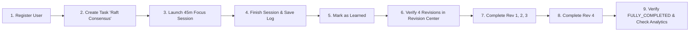

# LearnTrack — Testing Strategy & Quality Assurance Plan

**Document Version:** 1.0.0  
**Status:** Approved for Implementation  
**Test Runners:** Vitest (Unit & Integration) + Playwright (End-to-End User Journeys)  
**Standard:** Automated Test Pyramid with 100% Critical Business Logic Coverage

---

## 1. Testing Pyramid & Objectives

```
       / \
      / E2E \       Playwright: Full Critical Path (Registration -> Study -> 4 Revisions -> Mastery)
     /-------\
    /  Integ  \     Vitest: Server Actions + Prisma Test DB (Tenant Isolation, Transactions)
   /-----------\
  /    Unit     \   Vitest: Pure Functions (Date Math, Timer Delta Math, Mastery Invariants)
 /---------------\
```

---

## 2. Unit Testing Suite (Vitest)

### 2.1 Test Suite: Revision Date Calculation (`tests/unit/revision-calculator.test.ts`)
* **Test Case 1: Standard 4-Stage Interval Generation**
  * *Given:* Base completion date `2026-09-10` in timezone `"UTC"`.
  * *Expected Output:*
    * Rev 1: `2026-09-10` (Offset 0)
    * Rev 2: `2026-09-13` (Offset +3)
    * Rev 3: `2026-09-25` (Offset +15)
    * Rev 4: `2026-10-10` (Offset +30)
* **Test Case 2: Month and Leap Year Boundary Crossing**
  * *Given:* Base completion date `2024-02-25` (Leap year).
  * *Verify:* Day offsets correctly calculate February 29th and cross accurately into March.
* **Test Case 3: Timezone Shift Invariance**
  * *Given:* Completion logged at 11:45 PM in `"America/Los_Angeles"`.
  * *Verify:* Local calendar date reflects the user's active local day, not UTC morning.

### 2.2 Test Suite: Timer Delta Mathematics (`tests/unit/timer-math.test.ts`)
* **Test Case 1: Continuous Unpaused Countdown**
  * *Given:* `startTime = 100000`, `currentTime = 160000` (60s elapsed), `pausedDuration = 0`.
  * *Verify:* `elapsedSeconds = 60`, `remainingSeconds = 2640`.
* **Test Case 2: Accumulated Pause Duration**
  * *Given:* `startTime = 100000`, `currentTime = 200000` (100s elapsed), `pausedDuration = 30000` (30s paused).
  * *Verify:* `elapsedSeconds = 70`, `remainingSeconds = 2630`.
* **Test Case 3: Overflow Protection**
  * *Given:* User away for 4000 seconds ($> 2700$).
  * *Verify:* `remainingSeconds` clamps cleanly to `0` without negative integers.

### 2.3 Test Suite: Topic Mastery Invariant (`tests/unit/mastery-rule.test.ts`)
* **Test Case 1: Incomplete Revisions Reject Mastery**
  * *Given:* Task with Revisions 1, 2, 3 as `COMPLETED`, Revision 4 as `PENDING`.
  * *Verify:* `isMastered = false`, Task status remains `REVISION_PENDING`.
* **Test Case 2: All 4 Revisions Completed Unlocks Mastery**
  * *Given:* Revisions 1, 2, 3, 4 all marked `COMPLETED`.
  * *Verify:* `isMastered = true`, Task status transitions to `FULLY_COMPLETED`.

---

## 3. Integration Testing Suite (Vitest + Prisma)

Executed against an isolated test MySQL container or shadow database.

### 3.1 Test Suite: Multi-Tenant Data Isolation (`tests/integration/tenant-isolation.test.ts`)
* **Setup:** Create `UserA` and `UserB`. Create `TaskA` under `UserA`.
* **Test 1:** Attempt to retrieve `TaskA` while authenticated as `UserB`.
  * *Verify:* Returns `404 Not Found` or `401 Unauthorized`.
* **Test 2:** Attempt to execute `deleteTask(TaskA.id)` as `UserB`.
  * *Verify:* Fails with authorization error; `TaskA` remains intact in database.

### 3.2 Test Suite: Revision Generation Idempotency (`tests/integration/revision-generation.test.ts`)
* **Test 1:** Invoke `markTopicAsLearned(taskId)` twice consecutively.
  * *Verify:* Exactly 4 `Revision` records exist in the database. No duplicate key errors; transaction executes idempotently.

---

## 4. End-to-End Testing Suite (Playwright)

### 4.1 Critical Path Test: `tests/e2e/complete-learning-lifecycle.spec.ts`



* **Step 1:** User navigates to `/register`, completes registration, lands on `/dashboard`.
* **Step 2:** User clicks "+ Add Task", inputs `"Raft Consensus"`, planned for today, priority `HIGH`.
* **Step 3:** User clicks "Start Focus", timer canvas mounts showing `45:00`.
* **Step 4:** Fast-forward or click "Finish Early" (simulating completion), verify audio/notification trigger.
* **Step 5:** Fill Learning Log: "Learned leader election", confidence 4/5, click "Save".
* **Step 6:** Click "Mark as Learned", confirm dialog.
* **Step 7:** Navigate to `/revisions`, assert 4 revision milestones are present (Day 0, Day +3, Day +15, Day +30).
* **Step 8:** Complete Revision 1, 2, and 3. Verify task status is still `REVISION_PENDING`.
* **Step 9:** Complete Revision 4. Verify celebratory modal, task status badge changes to `FULLY_COMPLETED`, and analytics page registers the mastered topic.

---

## 5. Execution Commands & CI/CD Pipeline

```bash
# Run unit tests with Vitest in watch mode
npm run test:unit

# Run integration tests against test database
npm run test:integration

# Run Playwright end-to-end tests headless
npm run test:e2e

# Run complete verification suite
npm run test
```
