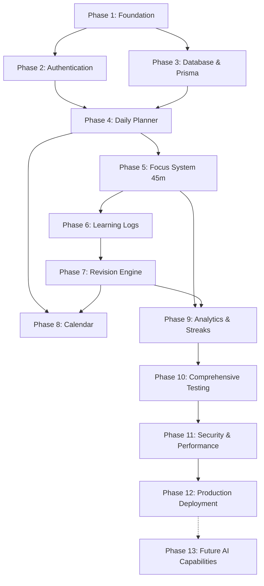

# LearnTrack — Phased Development Roadmap & Execution Plan

**Document Version:** 1.0.0  
**Status:** Approved for Implementation  
**Total Phases:** 12 MVP Phases + 1 Future AI Extension Phase  
**Delivery Model:** Iterative, Feature-Gated, Tested Milestones

---

## Roadmap Overview & Dependency Graph

---

## Phase 1 — Project Foundation & Design System
* **Objective:** Establish the Next.js App Router codebase, Tailwind CSS styling tokens, shadcn/ui component base, and project directory structure.
* **Tasks:**
  1. Initialize Next.js with TypeScript and ESLint (`create-next-app` structure).
  2. Configure Tailwind CSS with custom color palette (Slate, Royal Blue, Emerald, Violet).
  3. Install and configure `shadcn/ui` base primitives (Button, Dialog, Dropdown, Card, Input, Toast).
  4. Implement application Shell (Sidebar, Top Navigation, Theme Provider).
* **Definition of Done:** Project builds without errors, design system tokens render correctly, responsive shell navigates across stub routes.

---

## Phase 2 — Authentication & Multi-Tenant Authorization
* **Objective:** Implement secure user registration, login, session persistence, and tenant isolation using Auth.js.
* **Tasks:**
  1. Configure Auth.js (NextAuth v5) with Credentials Provider and HTTP-only cookies.
  2. Implement password hashing using Argon2id/bcrypt.
  3. Create `/login` and `/register` responsive pages with client/server validation.
  4. Implement protected route middleware redirecting unauthenticated users.
* **Definition of Done:** Users can register and log in; unauthorized access to `/dashboard` is prevented; session contains validated `userId`.

---

## Phase 3 — Database Architecture & Prisma Schema
* **Objective:** Deploy normalized MySQL database schema, migrations, and seed scripts.
* **Tasks:**
  1. Initialize Prisma schema with all core models (`User`, `UserSettings`, `Category`, `LearningTask`, `FocusSession`, `LearningLog`, `Revision`).
  2. Configure composite indexes for fast date and status lookups.
  3. Run initial database migration (`npx prisma migrate dev`).
  4. Create seed script (`prisma/seed.ts`) populating a sample user, categories, and past tasks.
* **Definition of Done:** Prisma Client generated, migrations pass cleanly against MySQL, database relationships and foreign keys verified.

---

## Phase 4 — Daily Planner & Learning Task Management
* **Objective:** Enable creation, editing, scheduling, priority assignment, and categorization of learning tasks.
* **Tasks:**
  1. Build Zod validation schemas for task creation and updates.
  2. Implement Server Actions: `createTask`, `updateTask`, `deleteTask`, `getDailyTasks`.
  3. Create `/planner` UI with Date Navigator, Task Cards, Category filters, and Add Task Modal.
  4. Implement task priority visual cues (Low, Medium, High).
* **Definition of Done:** Users can create, view, edit, and delete dated learning tasks; data strictly scoped to authenticated user.

---

## Phase 5 — 45-Minute Focus Session System
* **Objective:** Deliver the distraction-free 45-minute focus clock with timestamp delta math, tab-switching resilience, audio chime, and desktop notifications.
* **Tasks:**
  1. Implement Server Actions: `startFocusSession`, `pauseFocusSession`, `resumeFocusSession`, `completeFocusSession`.
  2. Develop custom hook `useFocusTimer` using `Date.now()` delta math and `localStorage` backup.
  3. Build `/focus` fullscreen canvas with tabular monospace timer, SVG progress ring, and controls.
  4. Integrate Web Notifications API and HTML5 Audio chime with user gesture pre-unlock.
* **Definition of Done:** 45-minute timer counts down accurately without drift during background tab throttling; triggers audio and desktop alerts upon completion.

---

## Phase 6 — Learning Session Logs & Reflection
* **Objective:** Capture post-session insights, practical accomplishments, unresolved doubts, notes, and 1–5 confidence ratings.
* **Tasks:**
  1. Implement Server Action `createLearningLog` with Zod validation.
  2. Build `LearningLogModal` that automatically triggers when a focus session completes.
  3. Implement `/tasks/[id]` screen showing timeline of completed sessions and accordion of learning logs.
  4. Update task metrics (`completedSessions`, `totalFocusMinutes`) upon log submission.
* **Definition of Done:** Every focus session can be reflected upon; reflections are stored permanently and displayed on the task detail page.

---

## Phase 7 — Spaced Revision Engine & Topic Mastery
* **Objective:** Automate the 4-interval spaced repetition workflow (Day 0, +3, +15, +30) and enforce the `FULLY_COMPLETED` rule.
* **Tasks:**
  1. Implement Server Action `markTopicAsLearned` creating 4 revisions inside an atomic Prisma `$transaction`.
  2. Implement deterministic date calculations in user's local timezone.
  3. Enforce composite unique constraint preventing duplicate revisions.
  4. Build `/revisions` Revision Center with Due, Upcoming, and Completed views.
  5. Implement Active Recall Drawer allowing learners to review past notes, submit revision notes, and log updated confidence.
  6. Implement Server Action `completeRevision` enforcing the promotion to `FULLY_COMPLETED` only when all 4 revisions are finished.
* **Definition of Done:** Revisions are generated idempotently; tasks advance through `REVISION_PENDING` to `FULLY_COMPLETED` only after Revision 4 completes.

---

## Phase 8 — Interactive Learning Calendar
* **Objective:** Provide a monthly and weekly schedule visualizer combining tasks, focus events, and revision deadlines.
* **Tasks:**
  1. Integrate `@fullcalendar/react` with month, week, and day views.
  2. Create API route `GET /api/calendar/events` returning color-coded items (Blue=Task, Purple=Revision, Green=Session).
  3. Implement event click drawers displaying full task logs and quick action triggers.
* **Definition of Done:** Calendar renders smoothly across desktop and mobile; shows accurate dates aligned with user's timezone.

---

## Phase 9 — Learning Analytics & Consistency Streak Engine
* **Objective:** Visualize focus hours, revision adherence rates, confidence progression curves, and verified learning day streaks.
* **Tasks:**
  1. Implement SQL/Prisma aggregation queries for daily, weekly, and monthly focus minutes.
  2. Build Recharts visualizations (BarChart for focus, LineChart for confidence, Donut for adherence).
  3. Implement the verified learning streak algorithm ($\ge 45$ min focus OR $\ge 1$ revision).
  4. Create `/analytics` dashboard with date range and category filters.
* **Definition of Done:** Charts render responsive SVG graphics; streak increments correctly on qualified days and resets on missed days.

---

## Phase 10 — Automated Testing & Quality Assurance
* **Objective:** Achieve high test coverage across critical business logic and user journeys using Vitest and Playwright.
* **Tasks:**
  1. Write Vitest unit tests for date math, timer delta calculation, and topic mastery rules.
  2. Write Vitest integration tests for multi-tenant isolation and transaction idempotency.
  3. Write Playwright E2E tests simulating full learner flow: Register -> Task -> Focus -> Log -> Revisions 1..4 -> Mastery.
* **Definition of Done:** All unit, integration, and E2E tests pass cleanly in automated test runners.

---

## Phase 11 — Security Auditing & Performance Tuning
* **Objective:** Ensure zero security vulnerabilities and optimize database query performance.
* **Tasks:**
  1. Verify multi-tenant query scoping across all Server Actions.
  2. Validate markdown sanitization against XSS in learning logs.
  3. Verify database query plans (`EXPLAIN`) utilizing composite indexes.
  4. Audit bundle size and configure Next.js image and font optimization.
* **Definition of Done:** Zero OWASP vulnerabilities; sub-50ms database queries; Lighthouse performance score $> 90$.

---

## Phase 12 — Production Deployment & Monitoring
* **Objective:** Deploy LearnTrack to production infrastructure with secure configuration.
* **Tasks:**
  1. Configure production MySQL database (PlanetScale, AWS RDS, or Railway).
  2. Deploy application to Vercel with environment secrets (`DATABASE_URL`, `AUTH_SECRET`).
  3. Verify SSL, domain configuration, and production build optimization.
  4. Configure error monitoring and uptime health checks (`/api/health`).
* **Definition of Done:** Application is live in production, fully operational, and meets all Definition of Done criteria.

---

## Phase 13 — Future AI Architecture (Post-MVP)
* **Objective:** Outline non-MVP AI extension points without introducing code in MVP.
* **Concepts:**
  * AI Topic Summarizer from multi-session logs.
  * Automated Active Recall Question Generator.
  * Concept Gap Analysis for low-confidence topics.
