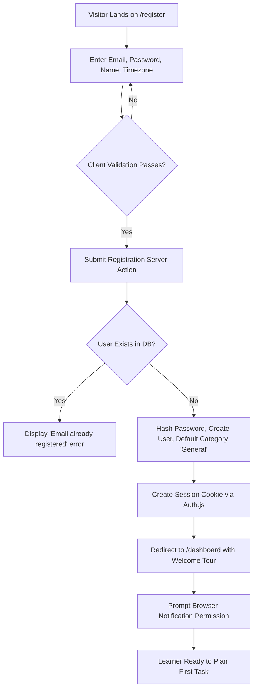
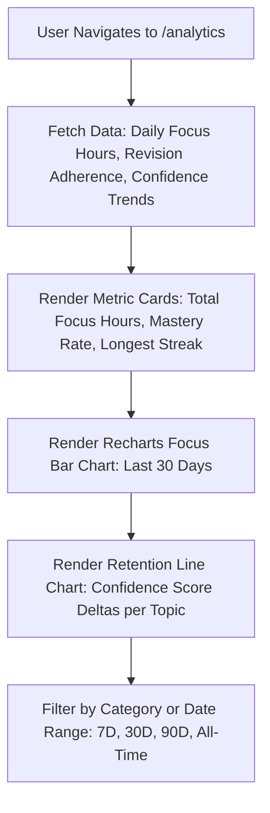
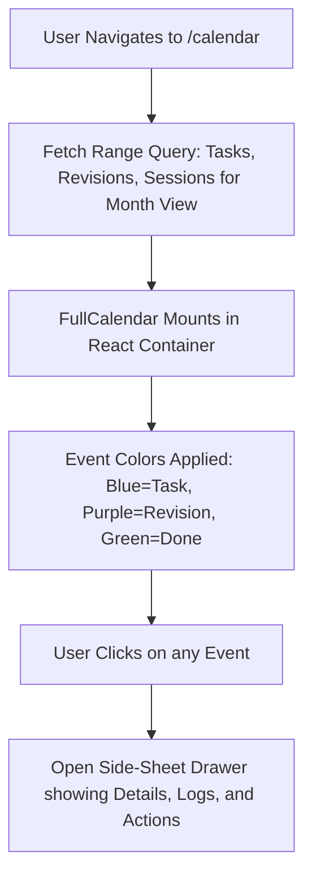

# LearnTrack — User Flows & Interaction Paths

**Document Version:** 1.0.0  
**Status:** Approved for Implementation  
**Notation:** Mermaid Flowcharts & Step-by-Step State Transition Sequences

---

## 1. Flow Overview
This document specifies the step-by-step user journeys and system logic pathways across all primary and edge-case scenarios within **LearnTrack**.

---

## 2. Flow 1: First-Time User Onboarding & Setup



### Edge Cases:
* **Timezone Detection Failure:** If `Intl.DateTimeFormat().resolvedOptions().timeZone` returns null or undefined, default to `"UTC"` and prompt learner to confirm in Settings.
* **Notification Permission Denied:** Show dismissible banner: *"Browser notifications are muted. In-app chimes and visual cues will alert you instead."*

---

## 3. Flow 2: Creating a Learning Task

```mermaid
graph TD
    A[User on /planner or /dashboard] --> B[Click '+ Add Learning Task']
    B --> C[Modal Opens: Form Rendered via React Hook Form]
    C --> D[Enter Title, Description, Category, Date, Priority, Est. Sessions]
    D --> E[Click 'Save Task']
    E --> F[Invoke Server Action: createTask(payload)]
    F --> G{Zod Server Validation}
    G -- Invalid --> H[Return Field Errors to Form]
    G -- Valid --> I[Prisma: INSERT into learning_tasks with status 'PLANNED']
    I --> J[Revalidate Path /planner and /dashboard]
    J --> K[Close Modal & Display Success Toast]
```

---

## 4. Flow 3: Starting a Focus Session (45 Minutes)

```mermaid
graph TD
    A[User Views Task Card] --> B[Click 'Start Focus']
    B --> C{Active Focus Session Exists?}
    C -- Yes --> D[Modal: 'Another session is currently running. Switch or Finish it?']
    C -- No --> E[Server Action: startFocusSession(taskId)]
    E --> F[Prisma: INSERT focus_sessions with status 'ACTIVE', plannedDuration=2700]
    F --> G[If task.status == 'PLANNED', UPDATE task to 'IN_PROGRESS']
    G --> H[Navigate/Mount Focus Timer Screen]
    H --> I[Initialize Client Timer with startTime and Target End Time]
    I --> J[Set document.title to '45:00 — [Task Title]']
```

---

## 5. Flow 4 & 5: Completing a Focus Session & Recording a Learning Log

```mermaid
graph TD
    A[Focus Timer Running: 45:00 Countdown] --> B{Elapsed Active Seconds >= 2700?}
    B -- No / User clicks 'Finish Early' --> C[Confirm Finish Early dialog]
    B -- Yes --> D[Session Completed Event Triggered]
    C --> D
    D --> E[Play HTML5 Audio Sound Effect]
    D --> F[Send Web Notification: 'Focus session complete!']
    D --> G[Flash Tab Title: '🔔 Session Finished!']
    D --> H[Invoke Server Action: completeFocusSession(sessionId, actualDuration)]
    H --> I[Prisma: UPDATE focus_sessions SET status='COMPLETED', actualDuration=...]
    I --> J[Automatically Display Learning Log Dialog]
    J --> K[User Enters: What learned, Completed, Doubts, Notes, Confidence 1-5]
    K --> L[Submit Form: createLearningLog(payload)]
    L --> M[Prisma: INSERT learning_logs]
    M --> N[Increment task totalFocusMinutes and completedSessions count]
    N --> O[Display Completion Summary: 'Great work! Ready for another session or mark as learned?']
```

### Edge Cases:
* **Browser Closed during Session:** Upon reopening, the system detects `FocusSession` with status `ACTIVE`. If `now() > startTime + plannedDuration`, prompts user: *"Your session ended while you were away. Would you like to record your log now?"* If user was away longer than 4 hours without interaction, session can be marked as `INTERRUPTED`.

---

## 6. Flow 6: Starting Another Focus Session on the Same Topic
* After submitting the first Learning Log, the user sees options:
  1. **"Start Another 45m Session"** → Returns immediately to Flow 3, incrementing the topic's session tally.
  2. **"Return to Planner"** → Leaves task in `IN_PROGRESS` for later study.
  3. **"Mark as Learned"** → Advances to Flow 7.

---

## 7. Flow 7 & 8: Marking a Topic as Learned & Spaced Revision Generation

```mermaid
graph TD
    A[User Clicks 'Mark as Learned' on Task Screen] --> B[Confirmation Dialog: 'Finish initial learning and start 30-day revision cycle?']
    B -- Confirmed --> C[Server Action: markTopicAsLearned(taskId)]
    C --> D[Execute Prisma Transaction $transaction]
    D --> E[Verify taskId belongs to authenticated userId]
    D --> F{Is task already LEARNING_COMPLETED or REVISION_PENDING?}
    F -- Yes --> G[Idempotent No-Op: Return existing revision schedule]
    F -- No --> H[UPDATE learning_tasks SET status='REVISION_PENDING', learningCompletedAt=now()]
    H --> I[Calculate Revision Dates: Day 0, Day +3, Day +15, Day +30]
    I --> J[Prisma: createMany revisions for numbers 1, 2, 3, 4]
    J --> K[Commit Transaction]
    K --> L[Display Revision Center Modal showing the 4 Scheduled Milestones]
```

### Date Calculation Details:
* Completion Date $D$ = User's local calendar day (e.g., `2026-09-10`).
* **Revision 1 (Day 0):** `2026-09-10` (Same day review).
* **Revision 2 (Day +3):** `2026-09-13`.
* **Revision 3 (Day +15):** `2026-09-25`.
* **Revision 4 (Day +30):** `2026-10-10`.

---

## 8. Flow 9: Completing a Spaced Revision

```mermaid
graph TD
    A[Revision Becomes Due on Scheduled Date] --> B[Appears in Dashboard 'Today's Revisions' & Revision Center]
    B --> C[User Clicks 'Review & Complete']
    C --> D[Drawer Opens: Display Prior Learning Logs, Doubts, and Notes]
    D --> E[User Performs Active Recall Review]
    E --> F[Optional: User can run a 45m Focus Session dedicated to this Revision]
    F --> G[User Enters: Revision Notes, Updated Doubts, New Confidence 1-5]
    G --> H[Click 'Complete Revision']
    H --> I[Server Action: completeRevision(revisionId, notes, confidence)]
    I --> J[Prisma: UPDATE revisions SET status='COMPLETED', completedAt=now()]
    J --> K{Are All 4 Revisions for this Task now COMPLETED?}
    K -- No --> L[Task remains REVISION_PENDING. Toast: 'Revision completed! Next revision in X days.']
    K -- Yes --> M[Advance to Flow 10: FULLY_COMPLETED]
```

---

## 9. Flow 10: Final Revision Completion & FULLY_COMPLETED Status

```mermaid
graph TD
    A[Revision 4 Submitted as COMPLETED] --> B[Database Query: Count incomplete revisions for taskId]
    B --> C{Count of incomplete revisions == 0?}
    C -- No --> D[Error / Safety Guard: Keep REVISION_PENDING]
    C -- Yes --> E[Execute Prisma Transaction]
    E --> F[UPDATE learning_tasks SET status='FULLY_COMPLETED', fullyCompletedAt=now()]
    E --> G[Increment User Lifetime Mastery Counter]
    G --> H[Render Confetti / Mastery Badge on UI]
    H --> I[Topic Archives to 'Mastered Topics' Section]
```

---

## 10. Flow 11: Viewing Analytics & Consistency Metrics



---

## 11. Flow 12: Reviewing Calendar Activity



---

## 12. Flow 13: Managing Notification & Sound Settings

```mermaid
graph TD
    A[User Navigates to /settings] --> B[Inspect Notification Permissions via browser API]
    B --> C{Permission Granted?}
    C -- No --> D[Show 'Enable Desktop Notifications' Button]
    D --> E[User Clicks Button -> Notification.requestPermission()]
    E --> F[Update Local State and Settings Record in DB]
    C -- Yes --> G[Show 'Enabled' with Test Notification Button]
    G --> H[Sound Toggle: ON/OFF, Volume Slider (0-100%), Sound Chime Preview]
    H --> I[Auto-save preferences to UserSettings table]
```
