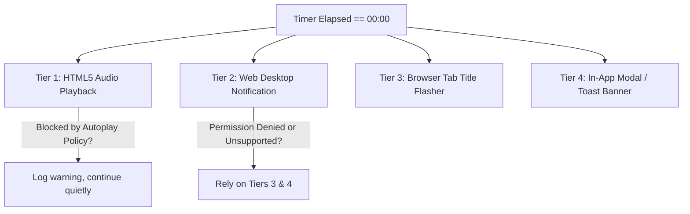

# LearnTrack — Notification & Audio Systems Specification

**Document Version:** 1.0.0  
**Status:** Approved for Implementation  
**APIs:** Web Notifications API + HTML5 Audio API  
**Resilience Standard:** Graceful Degradation across Permission Denials and Autoplay Restrictions

---

## 1. Multi-Tiered Alert Architecture

When a 45-minute focus session completes, LearnTrack engages a multi-tiered signaling system to ensure the learner is notified regardless of their active window or browser configuration:



---

## 2. Web Notifications API Specification

### 2.1 Permission Acquisition Workflow
1. **Initial Assessment:** On page load, `useNotification` checks `Notification.permission`.
2. **Contextual Prompting:** Permission is requested following a user action (e.g., clicking "Enable Notifications" in Settings or when launching their first focus session), avoiding annoying immediate browser popups on initial visit.
3. **Permission States:**
   * `'granted'`: Full system notifications enabled.
   * `'denied'`: Desktop notifications blocked by user. UI displays a helpful notice explaining how to re-enable via browser address bar settings.
   * `'default'`: Unprompted state. Triggers browser prompt on user CTA.
   * `Unsupported`: Older mobile or embedded browsers. Disabled silently without errors.

### 2.2 Notification Payload Configuration
```typescript
export function dispatchSessionCompletionNotification(taskTitle: string) {
  if (typeof window !== 'undefined' && 'Notification' in window && Notification.permission === 'granted') {
    const notification = new Notification("LearnTrack — Focus Complete!", {
      body: `45-minute focus block on "${taskTitle}" finished. Take a breath and log your learnings.`,
      icon: "/icons/icon-192x192.png",
      badge: "/icons/badge-72x72.png",
      tag: "learntrack-session-complete",
      renotify: true,
      silent: false,
    });

    notification.onclick = () => {
      window.focus();
      notification.close();
    };
  }
}
```

---

## 3. HTML5 Audio API & Sound Engine

### 3.1 Audio Asset Directory & Formats
Sound files are stored in `/public/sounds/` in dual formats for universal browser compatibility:
* `chime-bell.mp3` & `chime-bell.ogg` (Gentle bronze meditation bell)
* `chime-bowl.mp3` & `chime-bowl.ogg` (Resonant Tibetan singing bowl)
* `chime-gong.mp3` & `chime-gong.ogg` (Low-frequency soft gong)

### 3.2 Solving Browser Autoplay Restrictions
Modern browsers block programmatic audio playback unless the user has previously interacted with the document (the "Autoplay Policy").

**The Pre-Unlock Strategy:**
When the learner clicks the "Start Focus" button (an explicit user gesture), the application pre-initializes and unlocks the HTML5 `AudioContext` or loads the `Audio` object:
```typescript
class SoundManager {
  private audio: HTMLAudioElement | null = null;

  public initialize(soundPath: string, volume: number) {
    if (typeof window !== 'undefined') {
      this.audio = new Audio(soundPath);
      this.audio.volume = Math.max(0, Math.min(1, volume));
      // Pre-load audio data into browser buffer
      this.audio.load();
    }
  }

  public play() {
    if (!this.audio) return;
    this.audio.currentTime = 0;
    const playPromise = this.audio.play();
    if (playPromise !== undefined) {
      playPromise.catch((error) => {
        console.warn("Audio autoplay blocked by browser policy:", error);
      });
    }
  }
}
```

---

## 4. Browser Tab Title Flashing (Tier 3)

If the learner is browsing another tab when the session concludes, the document title oscillates at 1-second intervals:
```typescript
export function startTitleFlashing(originalTitle: string) {
  let isAlert = false;
  const interval = setInterval(() => {
    document.title = isAlert ? "🔔 Focus Complete!" : originalTitle;
    isAlert = !isAlert;
  }, 1000);

  // Stop flashing as soon as the user returns to the tab
  const handleFocus = () => {
    clearInterval(interval);
    document.title = originalTitle;
    window.removeEventListener("focus", handleFocus);
  };
  window.addEventListener("focus", handleFocus);
}
```

---

## 5. Settings Integration & User Controls

In `/settings`:
* **Sound Enabled Toggle:** Master switch to disable all audible tones.
* **Volume Slider:** Range input (0% to 100%) mapped to `soundVolume: Float` in `UserSettings`.
* **Sound Choice Dropdown:** Select between `"Bell"`, `"Tibetan Bowl"`, or `"Gong"`.
* **"Test Sound" Button:** Plays the selected chime immediately at the chosen volume to verify audio configuration.
